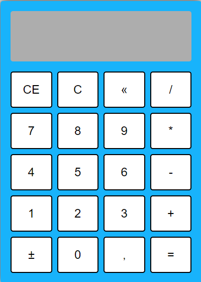

## CALCULADORA FUNCIONAL

- Este projeto mostra uma calculadora de operações matemáticas simples, somar diminuir, dividir, e multiplicar.

###

- Verifique o projeto

### Tecnologias Ultilizadas 💻
- HTML
- CSS
- JavaScript

### Autor 

-  [Willian Lopes](https://github.com/Willian-Py)
